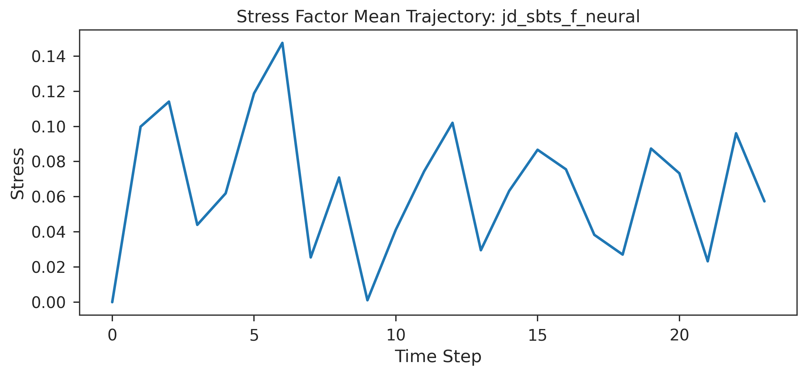

# SBTS Advanced: Lévy Processes & Schrödinger Bridge for Time Series Generation

[](https://www.python.org/downloads/)
[](https://opensource.org/licenses/MIT)
[](https://www.polytechnique.edu/)

> **Projet Scientifique Collectif (PSC)**  
> **Institution:** École Polytechnique (IP Paris)  
> **Academic Year:** 2025-2026

---

## Authors & Supervision

This project was developed by **Lizhan HONG** (*École Polytechnique*) under the supervision and guidance of **Prof. Huyên PHAM**.

---

## Overview

**SBTS Advanced** is a research-oriented implementation of generative modeling for financial time series using **Schrödinger Bridge (SB)** methods, **Lévy processes**, and **jump-diffusion SDEs**. The project focuses on generating realistic time series with heavy tails, discontinuous jumps, volatility clustering, and market-like stylized facts.

The active codebase now uses one unified model interface and one active experiment entry point:

- `main.py` is the maintained CLI pipeline for training, generation, evaluation, and plotting.
- `models/factory.py` owns the active model registry.
- `main_old.py` remains only as a compatibility shim.
- The old `baselines/` compatibility package has been removed; active baselines live under `models/`.

The current registry contains 10 models:

| Model key | Description |
|---|---|
| `jd_sbts` | Base Jump-Diffusion Schrödinger Bridge Time Series model |
| `jd_sbts_f` | JD-SBTS with stress-factor feedback for jump-volatility interaction |
| `jd_sbts_neural` | JD-SBTS with neural jump-intensity modeling |
| `jd_sbts_f_neural` | JD-SBTS with both feedback and neural jumps |
| `lightsb` | Light Schrödinger Bridge baseline with sum-exp quadratic potentials |
| `numba_sb` | Fast Numba-accelerated Markovian SB baseline |
| `timegan` | GRU-based TimeGAN baseline |
| `diffusion_ts` | DDPM-style diffusion baseline for time series |
| `rnn` | Autoregressive GRU/LSTM baseline |
| `transformer_ar` | Causal autoregressive Transformer baseline |

---

## Mathematical Framework

The core SBTS family is based on a jump-diffusion stochastic differential equation:

$$ dX_t = \mu(X_t, t)dt + \sigma(X_t, t)dW_t + dJ_t $$

where $W_t$ is Brownian motion and $J_t$ is a jump component. The implemented pipeline combines jump detection, local volatility calibration, drift estimation, and Euler-Maruyama generation. Feedback variants additionally model post-jump volatility amplification through a transient stress factor.

---

## Project Structure

```plaintext
sbts_advanced/
├── main.py                         # Active CLI experiment pipeline
├── main_old.py                     # Legacy compatibility shim
├── benchmark_main_pipeline.ipynb   # Main benchmark notebook and dataset builder
├── smoke_test_new_baselines.py     # Tiny end-to-end smoke test for RNN/Transformer baselines
├── models/
│   ├── base.py                     # Shared TimeSeriesGenerator API
│   ├── factory.py                  # Model registry, aliases, and default configs
│   ├── sbts_variants.py            # JD-SBTS, feedback, and neural-jump variants
│   ├── lightsb.py                  # LightSB and Numba-SB models
│   ├── timegan_baseline.py         # TimeGAN baseline
│   ├── diffusion_ts_baseline.py    # Diffusion-TS baseline
│   ├── rnn_baseline.py             # Autoregressive recurrent baseline
│   └── transformer_ar_baseline.py  # Causal autoregressive Transformer baseline
├── data/
│   └── loaders.py                  # ETF/Yahoo Finance and synthetic data loaders
├── metrics/
│   ├── statistical_metrics.py      # Statistical distances
│   ├── numba_metrics.py            # Accelerated metric implementations
│   ├── discriminative_score.py     # Classifier-based realism score
│   └── predictive_score.py         # Forecast-transfer predictive score
├── visualization/
│   ├── general.py                  # General experiment and benchmark plots
│   └── feedback_plots.py           # Feedback and stress-factor plots
├── notebook_outputs/
│   └── benchmark_main_pipeline/    # Cached benchmark datasets
└── results/
    ├── model_explanation.md        # Detailed model and parameter explanation
    ├── output.png                  # Benchmark summary figure
    ├── merton_*.png                # Merton experiment plots
    └── google_*.png                # Google/GOOGL experiment plots
```

---

## Datasets

### CLI Pipeline

`main.py` supports:

- Yahoo Finance ETF data through `data.loaders.load_etf_data`
- Synthetic GBM, GBM-jump, Heston, and OU paths through `load_synthetic_data`

The default CLI configuration uses ETF log returns for:

```text
tickers = SPY, QQQ, IWM, EEM, GLD
start_date = 2020-01-01
end_date = 2024-01-01
window_size = 60
stride = 10
```

For synthetic data, `window_size` and `synthetic_total_steps` are intentionally separate. This avoids the previous failure mode where `n_steps == window_size` produced too few sliding windows for neural baselines.

### Benchmark Notebook

`benchmark_main_pipeline.ipynb` builds and caches paper-style benchmark datasets under `notebook_outputs/benchmark_main_pipeline/datasets/`:

| Dataset | Current cached shape | Notes |
|---|---:|---|
| `merton` | `(1000, 101, 1)` | Merton jump-diffusion paths, path representation |
| `ou_standard` | `(1000, 101, 1)` | Ornstein-Uhlenbeck process, path representation |
| `ou_high_frequency` | `(1000, 1001, 1)` | Higher-frequency OU process |
| `google` | `(3846, 24, 6)` | GOOGL daily OHLCV-style windows, base-one normalized |

The Google dataset cache uses `GOOGL` from Yahoo Finance. The requested range is `2004-01-01` to `2019-12-31`; the actual available start date in the cached metadata is `2004-08-19`.

---

## Installation

```bash
git clone https://github.com/ApolloHong/sbts_advanced.git
cd sbts_advanced
pip install -r requirements.txt
```

Python 3.10+ is recommended. Core dependencies include `numpy`, `scipy`, `torch`, `pandas`, `matplotlib`, and `yfinance` for Yahoo Finance downloads.

---

## Usage

List all registered models:

```bash
python main.py --list-models
```

Run the default experiment:

```bash
python main.py
```

Run a specific model:

```bash
python main.py --model jd_sbts_f
python main.py --model rnn
python main.py --model transformer_ar
```

Run the full active registry benchmark through the CLI:

```bash
python main.py --benchmark
```

Smoke-test the new autoregressive baselines:

```bash
python smoke_test_new_baselines.py --model all
python smoke_test_new_baselines.py --model rnn
python smoke_test_new_baselines.py --model transformer_ar
```

All active models follow the same high-level API:

```python
model.fit(data, time_grid=None, verbose=True)
samples = model.generate(n_samples, n_steps=None, x0=None)
```

---

## Benchmark Protocol

The benchmark notebook now uses `MODELS_TO_RUN = list(list_models().keys())`, so it stays aligned with `models/factory.py`.

The fair-comparison settings in the current notebook are:

- all models train on the same training windows;
- all metrics use the same shared evaluation subset;
- conditioned SBTS models receive the same real initial states (`shared_x0`);
- autoregressive models receive the same real prefix windows (`shared_prefix_len_*`);
- unconditional models share the reset random seed and evaluation subset.

Important caveat: the current saved notebook output records `transformer_ar` as failed on the length-101 `ou_standard` benchmark because `transformer_ar_max_seq_len` was 64 while the sequence requires at least `seq_len - 1 = 100`. When running `transformer_ar` on this benchmark, set:

```python
config["transformer_ar_max_seq_len"] = data.shape[1]
```

before model construction.

---

## Latest Saved Benchmark Result

The current saved benchmark output in `benchmark_main_pipeline.ipynb` uses:

```text
dataset = ou_standard
seed = 42
train/val/test = 700/150/150
generation/evaluation samples = 64
epochs override = 25 for JD-SBTS drift, LightSB, diffusion, RNN, and Transformer; 20 for TimeGAN
```

Main metrics are lower-is-better:

| Model | Protocol | Wasserstein | ACF MSE | Predictive | Overall rank score |
|---|---|---:|---:|---:|---:|
| `jd_sbts_neural` | `shared_x0` | 0.040578 | 0.000221 | 0.499281 | 1.866667 |
| `jd_sbts_f_neural` | `shared_x0` | 0.046222 | 0.000227 | 0.499060 | 2.200000 |
| `rnn` | `shared_prefix_len_50` | 0.282918 | 0.000071 | 0.546354 | 3.266667 |
| `diffusion_ts` | `shared_seed_only` | 0.288569 | 0.006900 | 0.570319 | 5.000000 |
| `lightsb` | `shared_seed_only` | 0.399893 | 0.006888 | 0.568908 | 5.133333 |
| `jd_sbts_f` | `shared_x0` | 0.332305 | 0.003098 | 0.887355 | 5.200000 |
| `jd_sbts` | `shared_x0` | 0.317969 | 0.003108 | 0.895484 | 5.333333 |
| `numba_sb` | `shared_seed_only` | 2.596094 | 0.008363 | 0.526521 | 6.300000 |
| `timegan` | `shared_seed_only` | 0.563282 | 0.002934 | 1.155755 | 6.600000 |

On this saved OU-standard run, the neural-jump SBTS variants dominate the main distributional metrics. The plain `jd_sbts` and `jd_sbts_f` variants remain strongest on the notebook's stylized-facts relative-error score, while the neural-jump variants better match Wasserstein, ACF, predictive, and discriminative metrics.

The detailed architecture and parameter-count notes are in `results/model_explanation.md`.

---

## Result Artifacts

Saved result artifacts currently include:

- `results/output.png`: benchmark summary figure;
- `results/merton_*.png`: Merton benchmark visualizations;
- `results/google_*.png`: Google/GOOGL benchmark visualizations;
- `results/model_explanation.md`: model-by-model architecture and parameter discussion.



---

## Key Features

- Jump-diffusion SBTS generation with static or neural jump modeling.
- Feedback variants for jump-volatility interaction and volatility clustering.
- Local volatility calibration with KDE-style estimators.
- LSTM drift estimation on purified trajectories.
- LightSB, Numba-SB, TimeGAN, diffusion, RNN, and Transformer baselines behind one factory interface.
- Numba-accelerated statistical metrics.
- Discriminative and predictive scores for generated time series evaluation.
- Notebook-based reproducible benchmark dataset construction with cached metadata and splits.

---

## License

This repository is released under the MIT License.
